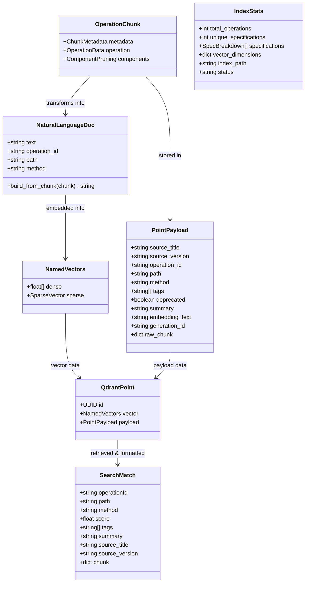
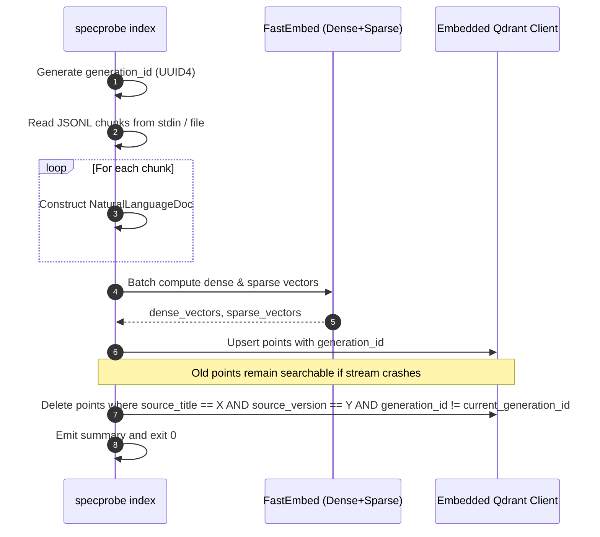
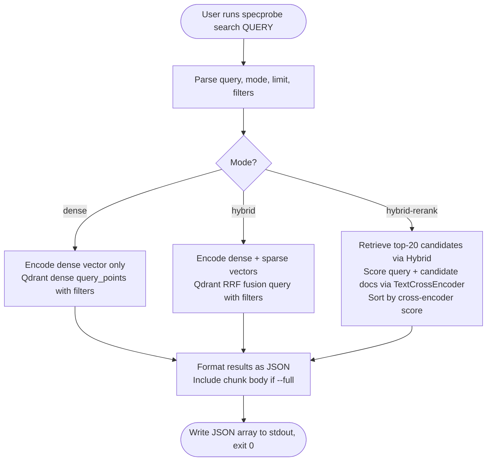

# Data Model: Local Vector Indexing & Semantic Search

**Feature**: `002-index-embed`  
**Date**: 2026-09-19  
**Status**: Draft

---

## 1. Entities Overview



---

## 2. Detailed Entity Schemas

### 2.1 NaturalLanguageDoc (Synthesized Embedding Text)

Constructed per operation before vectorization. Does **not** contain raw JSON schemas or curly brace formatting.

| Field | Type | Description |
|-------|------|-------------|
| `method` | `str` | HTTP method (e.g. `GET`, `POST`, `DELETE`) |
| `path` | `str` | URL path template (e.g. `/pets/{petId}`) |
| `summary` | `str` | Operation summary |
| `description` | `str` | Operation description |
| `tags` | `list[str]` | Categorical tags |
| `parameters` | `list[str]` | Parameter summaries: `{name} ({in}, {required|optional}): {description} ({type})` |
| `request_body`| `str` | Request body description, content types, and schema type/title |
| `responses` | `list[str]` | Response status codes, descriptions, and schema type/title |
| `text` | `str` | Assembled natural-language document passed to `fastembed` |

**Assembly Format**:
```text
GET /pets/{petId} — Retrieve a pet by ID.
Summary: Retrieve a pet by ID.
Description: Returns a single pet based on its unique identifier.
Tags: pets.
Parameters:
  - petId (path, required): Numeric identifier of the pet. (type: integer)
Responses:
  - 200 (application/json): Successful pet lookup. (type: Pet)
  - 404 (application/json): Pet not found. (type: Error)
```

---

### 2.2 QdrantPoint (Local Storage Record)

Persistent vector record stored inside the embedded Qdrant collection named `specprobe_operations`.

| Field | Type | Storage Target | Description |
|-------|------|----------------|-------------|
| `id` | `UUID` | Point ID | Deterministic UUIDv5 generated from `f"{source_title}:{source_version}:{operation_id}"` |
| `vector["dense"]` | `list[float]` | Dense Index | 384-dimensional dense vector generated by `BAAI/bge-small-en-v1.5` |
| `vector["sparse"]`| `SparseVector` | Sparse Index | Sparse indices (`list[int]`) and token weights (`list[float]`) from `Qdrant/bm25` |
| `payload` | `PointPayload` | Payload Store | JSON-compatible dictionary for filtering and retrieval |

---

### 2.3 PointPayload (Search & Filter Metadata)

| Field | Type | Indexing | Description |
|-------|------|----------|-------------|
| `source_title` | `str` | Keyword Index | OpenAPI title (e.g. `Petstore API`) |
| `source_version` | `str` | Keyword Index | OpenAPI version (e.g. `1.0.0`) |
| `operation_id` | `str` | Keyword Index | Operation identifier (e.g. `getPetById`) |
| `path` | `str` | Text | Endpoint URI path (e.g. `/pets/{petId}`) |
| `method` | `str` | Keyword Index | Uppercase HTTP method (e.g. `GET`) |
| `tags` | `list[str]` | Keyword Index | Assigned operation tags |
| `deprecated` | `bool` | Boolean Index | Deprecation flag |
| `summary` | `str \| None` | Text | Short summary string |
| `embedding_text` | `str` | Stored | Natural-language embedding text |
| `generation_id` | `str` | Keyword Index | UUID4 tracking the indexing run for atomic deletion |
| `raw_chunk` | `dict` | Stored | Complete `OperationChunk` dictionary (returned when `--full` is specified) |

---

### 2.4 SearchMatch (Output Model)

Result emitted on `stdout` as an array of JSON objects.

| Field | Type | Included By Default | Description |
|-------|------|---------------------|-------------|
| `operationId` | `str` | Yes | Unique operation ID |
| `path` | `str` | Yes | Endpoint URI path |
| `method` | `str` | Yes | HTTP method in uppercase |
| `score` | `float` | Yes | Ordinal relevance score (dense cosine, hybrid RRF, or rerank cross-encoder) |
| `tags` | `list[str]` | Yes | List of operation tags |
| `summary` | `str \| None` | Yes | Operation summary (or `null`) |
| `source_title` | `str` | Yes | API specification title |
| `source_version`| `str` | Yes | API specification version |
| `chunk` | `dict \| None`| Only with `--full` | Full `OperationChunk` data payload (parameters and pruned schemas) |

---

### 2.5 IndexStats (Diagnostic Entity)

Emitted by `specprobe index --stats`.

| Field | Type | Description |
|-------|------|-------------|
| `total_operations` | `int` | Total number of operation points in the active collection |
| `unique_specifications` | `int` | Count of unique `(source_title, source_version)` tuples |
| `specifications` | `list[dict]` | Breakdown containing `title`, `version`, and `chunk_count` |
| `vector_dimensions` | `dict` | Description of dense and sparse vector configurations |
| `index_path` | `str` | Absolute path to the on-disk Qdrant storage directory |
| `status` | `str` | Overall health status (`"healthy"`, `"empty"`) |

---

## 3. State & Lifecycle Transitions

### 3.1 Ingestion & Idempotent Atomic Replacement



### 3.2 Retrieval Lifecycle Across Modes


