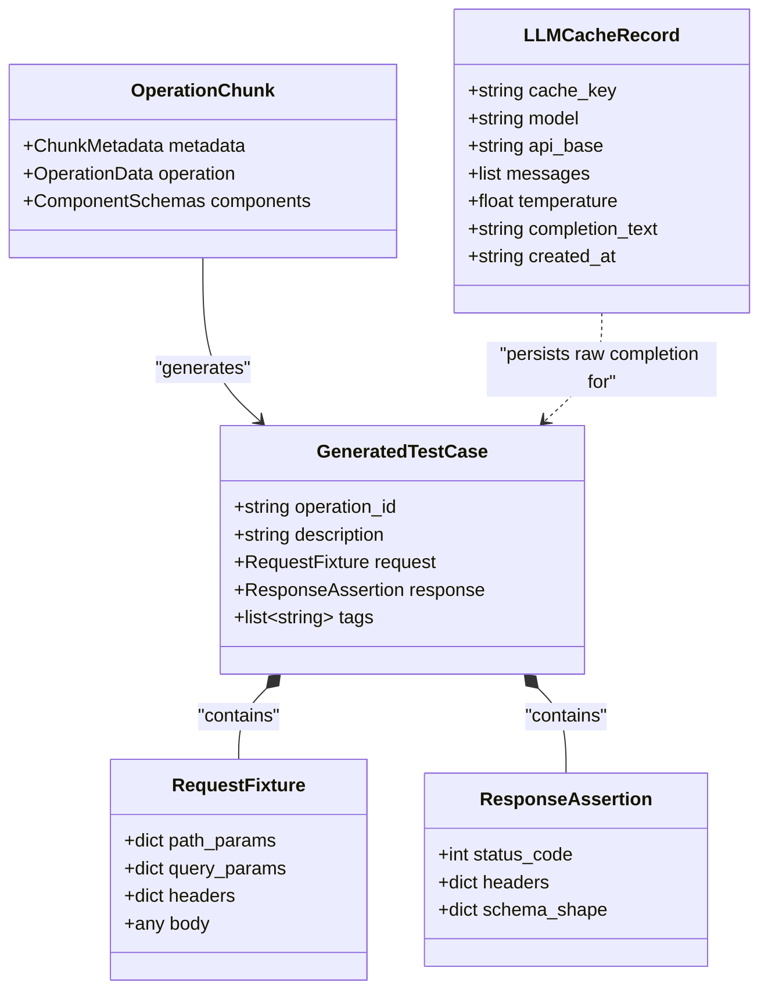

# Data Model: LLM Test Generation & Filter-Only Search

**Feature**: `003-generate-llm-tests`
**Date**: 2026-09-19
**Status**: Completed

---

## 1. Entity Overview

The test generation pipeline consumes `OperationChunk` data from `specprobe search --full`, synthesizes natural-language prompts, invokes the unified LiteLLM gateway with deterministic disk caching, strictly validates output against Pydantic models, and streams executable test cases as JSON Lines (JSONL).



---

## 2. Core Entities & Field Specifications

### 2.1 `GeneratedTestCase`
The top-level traceable test definition emitted to `stdout` as a JSONL object.

| Field | Type | Required | Description | Validation Rules |
| :--- | :--- | :---: | :--- | :--- |
| `operation_id` | `str` | Yes | Traceable identifier of the target API operation | Non-empty string. Must match chunk's `operationId` or deterministic method/path fallback. |
| `description` | `str` | Yes | Plain-language scenario description | Non-empty explanation of the happy-path behavior tested. |
| `request` | `RequestFixture` | Yes | Proposed request input values | Must conform to `RequestFixture` schema. |
| `response` | `ResponseAssertion` | Yes | Expected response verification criteria | Must conform to `ResponseAssertion` schema. |
| `tags` | `list[str]` | No | Categorical tags inherited from the operation | Defaults to empty list `[]`. |

### 2.2 `RequestFixture`
Encapsulates concrete test inputs for executing an HTTP request against the API endpoint.

| Field | Type | Required | Description | Validation Rules |
| :--- | :--- | :---: | :--- | :--- |
| `path_params` | `dict[str, Any]` | No | Parameter replacements for path templates (e.g. `{petId}`) | Defaults to `{}`. Keys must match template parameters in endpoint path. |
| `query_params` | `dict[str, Any]` | No | Key-value pairs for URL query string | Defaults to `{}`. Keys match operation query parameters. |
| `headers` | `dict[str, str]` | No | Request headers (e.g. `Content-Type`, `Accept`) | Defaults to `{}`. Header values must be strings. |
| `body` | `Any \| None` | No | Request body payload conforming to request schema | Defaults to `None`. Required if operation mandates a request body. |

### 2.3 `ResponseAssertion`
Defines expected verification criteria to assert against the API response.

| Field | Type | Required | Description | Validation Rules |
| :--- | :--- | :---: | :--- | :--- |
| `status_code` | `int` | Yes | Expected HTTP response status code | Standard HTTP status code (typically `200`..`299` for happy path). |
| `headers` | `dict[str, str]` | No | Expected response headers | Defaults to `{}`. |
| `schema_shape` | `dict[str, Any] \| None` | No | Expected JSON response structure or key property assertions | Defaults to `None`. Captures top-level property types or schema shape. |

### 2.4 `LLMCacheRecord`
Persistent record stored in `.specprobe/cache/<cache_key>.json`.

| Field | Type | Required | Description | Validation Rules |
| :--- | :--- | :---: | :--- | :--- |
| `cache_key` | `str` | Yes | SHA-256 hash of canonical prompt payload (messages, model, temperature) — strictly excluding endpoint routing URL | 64-character hex string. |
| `model` | `str` | Yes | Model identifier string (e.g. `openai/local-model`) | Non-empty string. |
| `api_base` | `str` | Yes | Model endpoint base URL (persisted as informational metadata for debugging; not included in cache key) | Valid URI format. |
| `messages` | `list[dict]` | Yes | Message history payload sent to model gateway | List of objects with `role` and `content`. |
| `temperature` | `float` | Yes | Sampling temperature | Typically `0.0`. |
| `completion_text` | `str` | Yes | Raw completion string returned by model | Non-empty string. |
| `created_at` | `str` | Yes | ISO 8601 timestamp of cache creation | Valid ISO timestamp. |

---

## 3. Lifecycle & Single-Retry Generation Flow

The generation lifecycle enforces Constitution Principle V (single retry on validation failure) and fail-safe batch execution.

```mermaid
sequenceDiagram
    autonumber
    participant CLI as specprobe generate
    participant Engine as GenerationEngine
    participant Cache as DiskCache
    participant Gateway as LLMGateway
    participant Model as Language Model (LM Studio)

    CLI->>Engine: Process OperationChunk
    Engine->>Engine: Build initial prompt messages
    Engine->>Cache: Query cache(cache_key)

    alt Cache Hit
        Cache-->>Engine: Cached completion_text
    else Cache Miss
        Engine->>Gateway: complete(messages)
        Gateway->>Model: POST /v1/chat/completions
        Model-->>Gateway: Response text
        Gateway->>Cache: Save cache entry
        Gateway-->>Engine: Response text
    end

    Engine->>Engine: Validate against GeneratedTestCase

    alt Validation Succeeded
        Engine-->>CLI: Stream GeneratedTestCase (JSONL)
    else Validation Failed (Attempt 1)
        Engine->>Engine: Construct retry prompt with schema error context
        Engine->>Cache: Query cache(retry_cache_key)

        alt Retry Cache Hit
            Cache-->>Engine: Cached retry completion_text
        else Retry Cache Miss
            Engine->>Gateway: complete(retry_messages)
            Gateway->>Model: POST /v1/chat/completions
            Model-->>Gateway: Corrected response text
            Gateway->>Cache: Save retry cache entry
            Gateway-->>Engine: Corrected response text
        end

        Engine->>Engine: Validate retry against GeneratedTestCase

        alt Retry Succeeded
            Engine-->>CLI: Stream GeneratedTestCase (JSONL)
        else Retry Failed (Attempt 2)
            Engine->>CLI: Log error to stderr; skip operation
        end
    end
```

---

## 4. State Transitions for Generation Batch

| Initial State | Event | Next State | Action / Output |
| :--- | :--- | :--- | :--- |
| `PENDING` | Read search result with `chunk` | `GENERATING` | Build prompt, check cache. |
| `GENERATING` | Completion received & valid | `SUCCESS` | Stream JSONL to `stdout`, increment `success_count`. |
| `GENERATING` | Validation error (Attempt 1) | `RETRYING` | Inject validation feedback, re-invoke gateway. |
| `RETRYING` | Retry completion valid | `SUCCESS` | Stream JSONL to `stdout`, increment `success_count`. |
| `RETRYING` | Retry validation error (Attempt 2) | `FAILED` | Log error to `stderr`, increment `failed_count`, continue batch. |
| `BATCH_COMPLETE` | All operations processed | `EXIT` | Exit code 0 if `success_count > 0` or 0 items in input; exit code 1 if all failed. |
