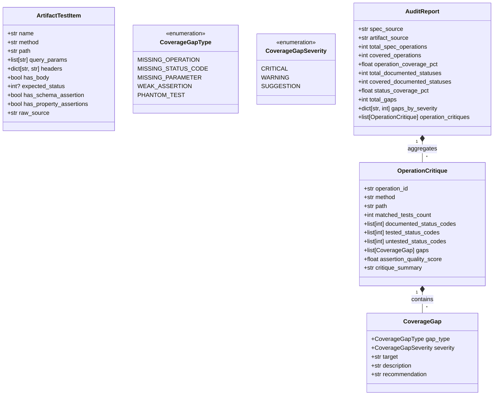

# Data Model: Schema Hardening & Artifact Audit

**Feature**: `005-schema-hardening-and-audit`
**Date**: 2026-09-20
**Status**: Complete

---

## 1. Schema Hardening Data Models (`src/specprobe/generator/models.py`)

### Updated `ResponseAssertion`

```python
class ResponseAssertion(BaseModel):
    """Verification assertions for evaluating the API response."""

    model_config = ConfigDict(extra="ignore")

    status_code: int = Field(
        ge=100,
        le=599,
        description="Expected HTTP response status code (targeting 2xx success).",
    )
    headers: dict[str, str] = Field(
        default_factory=dict,
        description="Expected response headers (e.g. Content-Type).",
    )
    schema_shape: dict[str, Any] | None = Field(
        default=None,
        description=(
            "Expected JSON schema structure conforming strictly to JSON Schema Draft 7. "
            "Must be a valid, self-contained schema object with no unresolved $ref pointers."
        ),
    )

    @field_validator("schema_shape")
    @classmethod
    def validate_schema_shape(cls, v: Any) -> dict[str, Any] | None:
        """Validate that schema_shape is a valid, self-contained JSON Schema Draft 7 object."""
        if v is None:
            return None
        if not isinstance(v, dict):
            raise ValueError(f"schema_shape must be a dictionary or None, got {type(v).__name__}")

        # Meta-schema validation against JSON Schema Draft 7
        try:
            Draft7Validator.check_schema(v)
        except SchemaError as err:
            raise ValueError(f"Invalid JSON Schema Draft 7 structure: {err.message}") from err

        # Self-contained guarantee: disallow unresolved top-level or bare $ref pointers
        if "$ref" in v and not any(
            k in v
            for k in ("definitions", "$defs", "properties", "items", "allOf", "anyOf", "oneOf")
        ):
            raise ValueError(
                f"schema_shape contains an unresolved bare $ref pointer '{v['$ref']}'. "
                "Schemas must be self-contained and inline their structural definitions."
            )

        return v
```

### Relationship with `GeneratedTestCase`

```text
GeneratedTestCase
├── operation_id: str           (Required identifier of target API operation)
├── description: str            (Plain-language description of test scenario)
├── request: RequestFixture
│   ├── method: str | None      (HTTP method)
│   ├── path: str | None        (Path template)
│   ├── path_params: dict       (Substituted path parameters)
│   ├── query_params: dict      (Key-value query parameters)
│   ├── headers: dict           (HTTP request headers)
│   └── body: Any | None        (Structured JSON payload, or None)
├── response: ResponseAssertion
│   ├── status_code: int        (Expected HTTP status code)
│   ├── headers: dict           (Expected response headers)
│   └── schema_shape: dict|None [HARDENED] (Strict JSON Schema Draft 7 object)
└── tags: list[str]             (Categorization tags)
```

---

## 2. Exporter Schema Transformations

### Postman Test Script Format (`src/specprobe/exporter/postman.py`)

When `test_case.response.schema_shape` is present, the test script emits a Postman `jsonSchema` assertion:

```javascript
pm.test("Status code is 200", function () {
    pm.response.to.have.status(200);
});

pm.test("Header content-type is present", function () {
    pm.response.to.have.header("content-type");
});

pm.test("Response matches JSON Schema", function () {
    var schema = {
        "type": "object",
        "required": ["id", "name"],
        "properties": {
            "id": { "type": "integer" },
            "name": { "type": "string" },
            "tag": { "type": "string" }
        }
    };
    pm.response.to.have.jsonSchema(schema);
});
```

*Note*: If `schema_shape` is `None` (e.g. HTTP 204 No Content), the `Response matches JSON Schema` test block is omitted entirely.

### REST Client (`.http`) Schema Signature (`src/specprobe/exporter/http_client.py`)

Format expected response schemas as a concise signature line:

```http
###
# @name showPetById
# Operation: showPetById
# Description: Returns a user's pet by unique identifier
# Expected Status: 200
# Expected Schema: object (properties: id, name, tag)
GET {{baseUrl}}/pets/42 HTTP/1.1
Accept: application/json
```

*Array responses*:
```http
# Expected Schema: array of object (properties: id, name, tag)
```

*Primitive or empty responses*:
```http
# Expected Schema: string
```
(Omitted when `schema_shape` is `None`).

---

## 3. Audit Domain Models (`src/specprobe/audit/models.py`)



### Entity Specifications

#### `ArtifactTestItem`

Represents a normalized API request extracted from either a Postman Collection v2.1 JSON or a REST Client `.http` file.

| Field | Type | Description |
|---|---|---|
| `name` | `str` | Item name or `@name` comment |
| `method` | `str` | HTTP verb in uppercase (`GET`, `POST`, etc.) |
| `path` | `str` | Request path or path template (`/pets/{{petId}}` or `/pets/123`) |
| `query_params` | `list[str]` | Detected query parameter names |
| `headers` | `dict[str, str]` | Header key-value pairs |
| `has_body` | `bool` | True if request includes a payload |
| `expected_status` | `int | None` | Extracted expected HTTP status code from assertions/comments |
| `has_schema_assertion` | `bool` | True if `pm.response.to.have.jsonSchema` or `# Expected Schema:` present |
| `has_property_assertions` | `bool` | True if property checks (`jsonData.to.have.property`) present |
| `raw_source` | `str` | Source identifier or line number |

#### `CoverageGap`

Represents a specific discrepancy identified between the specification and the test artifact.

| Field | Type | Description |
|---|---|---|
| `gap_type` | `CoverageGapType` | Classification (`missing_operation`, `missing_status_code`, etc.) |
| `severity` | `CoverageGapSeverity` | Impact rating (`critical`, `warning`, `suggestion`) |
| `target` | `str` | Identifier of affected target (`showPetById`, `404`, `limit`) |
| `description` | `str` | Explanation of the coverage omission or weakness |
| `recommendation` | `str` | Concrete action to resolve the gap |

#### `OperationCritique`

Per-operation assessment combining algorithmic metrics with LLM semantic critique.

| Field | Type | Description |
|---|---|---|
| `operation_id` | `str` | Specification operation identifier |
| `method` | `str` | HTTP method |
| `path` | `str` | Path template |
| `matched_tests_count` | `int` | Number of test requests matching this operation |
| `documented_status_codes` | `list[int]` | Status codes declared in specification |
| `tested_status_codes` | `list[int]` | Status codes asserted in test artifact |
| `untested_status_codes` | `list[int]` | Status codes missing test coverage |
| `gaps` | `list[CoverageGap]` | Discovered gaps for this operation |
| `assertion_quality_score` | `float` | Quality score from 0.0 (untested) to 1.0 (strict schema + status + headers) |
| `critique_summary` | `str` | LLM-generated narrative critique and recommendations |

#### `AuditReport`

Aggregated summary of entire audit run, formatted for display or JSON output.

| Field | Type | Description |
|---|---|---|
| `spec_source` | `str` | Source specification identifier or file path |
| `artifact_source` | `str` | Evaluated artifact file or standard input identifier |
| `total_spec_operations` | `int` | Count of operations in specification |
| `covered_operations` | `int` | Count of operations with at least one test |
| `operation_coverage_pct` | `float` | Percentage of operations covered (0.0 to 100.0) |
| `total_documented_statuses`| `int` | Total count of status codes across all operations |
| `covered_documented_statuses`| `int` | Count of status codes exercised by tests |
| `status_coverage_pct` | `float` | Percentage of status codes covered |
| `total_gaps` | `int` | Total identified gaps |
| `gaps_by_severity` | `dict[str, int]` | Gaps grouped by severity |
| `operation_critiques` | `list[OperationCritique]`| List of individual operation critique records |
