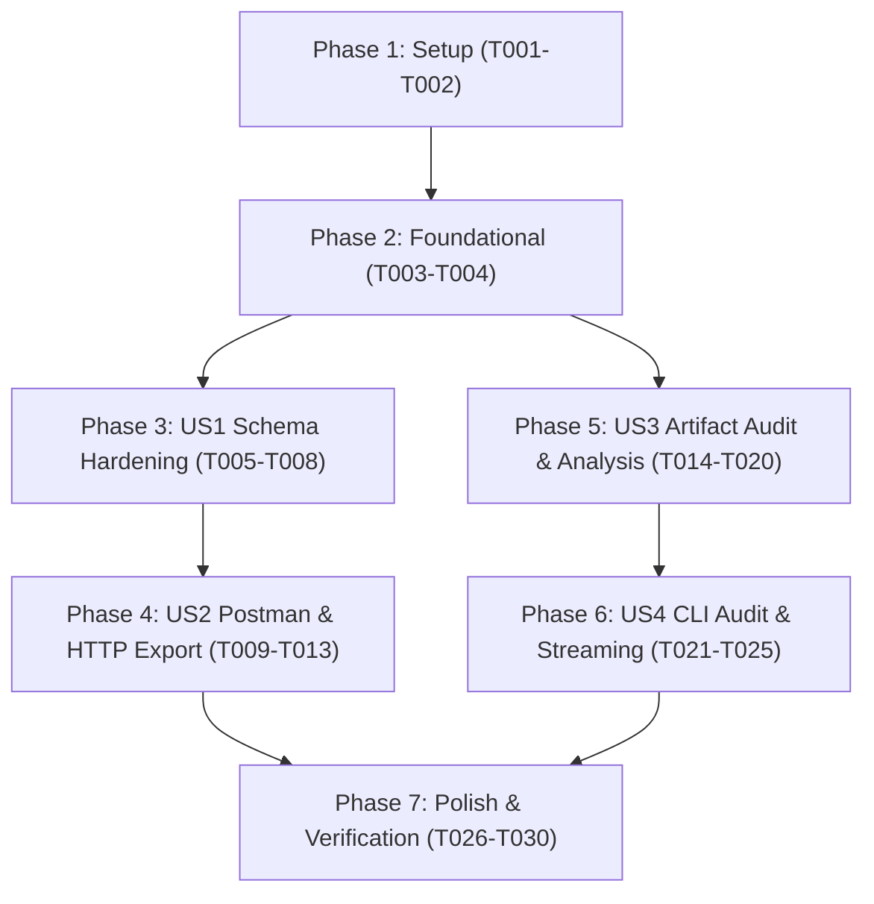

# Tasks: Schema Hardening & Artifact Audit

**Feature Branch**: `005-schema-hardening-and-audit`
**Specification**: [`specs/005-schema-hardening-and-audit/spec.md`](spec.md)
**Implementation Plan**: [`specs/005-schema-hardening-and-audit/plan.md`](plan.md)
**Status**: Ready for Implementation

---

## Phase 1: Setup (Shared Infrastructure)

**Purpose**: Initialize audit package directory structure, prompt templates, and sample test fixtures.

- [x] T001 Create audit package directory `src/specprobe/audit/__init__.py` and audit prompt template `prompts/audit.md`
- [x] T002 [P] Create audit test fixtures with intentional coverage gaps in `tests/fixtures/audit_postman_collection.json` and `tests/fixtures/audit_sample_requests.http`

---

## Phase 2: Foundational (Blocking Prerequisites)

**Purpose**: Core audit data models, formatters, and utilities that subsequent user stories depend on.

**CRITICAL**: No user story implementation can begin until this phase is complete.

- [x] T003 [P] Implement audit domain models in `src/specprobe/audit/models.py` (`ArtifactTestItem`, `CoverageGapType`, `CoverageGapSeverity`, `CoverageGap`, `OperationCritique`, `AuditReport`)
- [x] T004 [P] Implement schema signature formatting helper `format_schema_signature(schema_shape)` in `src/specprobe/exporter/utils.py` formatting single-line `# Expected Schema: <type> (properties: ...)` comments

**Checkpoint**: Foundational models and helpers ready — user story implementation can now proceed.

---

## Phase 3: User Story 1 - Validated JSON Schema in Test Case Generation (Priority: P1) 🎯 MVP (Part A)

**Goal**: Require and validate real JSON Schema Draft 7 for `GeneratedTestCase.response.schema_shape` during `specprobe generate`, reject unresolvable `$ref` pointers, and feed validation errors back into the existing single-retry self-correction loop.

**Independent Test**: Run `specprobe generate` with valid and invalid schema responses; verify schemas validate against Draft 7 meta-schema via `jsonschema.Draft7Validator.check_schema()`, invalid schemas/unresolvable `$ref` trigger retry with diagnostics feedback, and repeated failures record operation errors without killing the batch.

### Tests for User Story 1

- [x] T005 [P] [US1] Write unit tests for JSON Schema Draft 7 validation and self-correcting retry in `tests/unit/test_schema_hardening.py` (verifying valid Draft 7 schemas, malformed schema rejection, bare `$ref` rejection, single-retry self-correction feedback, and partial-failure batch resilience)

### Implementation for User Story 1

- [x] T006 [US1] Update `ResponseAssertion` model in `src/specprobe/generator/models.py` with `@field_validator("schema_shape")` enforcing `jsonschema.Draft7Validator.check_schema(v)` and rejecting bare unresolvable `$ref` pointers
- [x] T007 [US1] Update generation prompt in `prompts/generate.md` to instruct the LLM to output valid, self-contained JSON Schema Draft 7 objects for `schema_shape` when response bodies are expected
- [x] T008 [US1] Verify single-retry self-correction loop in `src/specprobe/generator/engine.py` passes Pydantic validation error diagnostics back to LiteLLM gateway and records operation errors gracefully on second failure

**Checkpoint**: User Story 1 is fully functional and guarantees strictly valid JSON Schema Draft 7 outputs from `specprobe generate`.

---

## Phase 4: User Story 2 - Full-Fidelity Postman & REST Client Schema Assertion Export (Priority: P2)

**Goal**: Upgrade Postman exporter to emit `pm.response.to.have.jsonSchema(schema)` assertions and REST Client exporter to emit `# Expected Schema: <type> (properties: ...)` signatures; omit schema assertions when no body is expected (e.g. HTTP 204 or `None`); update golden fixtures to maintain byte-identical determinism.

**Independent Test**: Export test cases bearing validated schemas into Postman collections and `.http` files; verify `pm.response.to.have.jsonSchema` blocks and `# Expected Schema:` comments are emitted, bodyless responses omit them, and golden fixture regression tests pass byte-for-byte.

### Tests for User Story 2

- [x] T009 [P] [US2] Update exporter unit tests in `tests/unit/test_exporter_postman.py` and `tests/unit/test_exporter_http.py` to assert `pm.response.to.have.jsonSchema` blocks and `# Expected Schema:` signatures
- [x] T010 [P] [US2] Update golden test fixtures in `tests/fixtures/golden/` and regression assertions in `tests/integration/test_export_cli.py` to match the new schema assertion format

### Implementation for User Story 2

- [x] T011 [US2] Upgrade Postman exporter in `src/specprobe/exporter/postman.py` to emit `pm.response.to.have.jsonSchema(schema)` test script blocks when `schema_shape` is present and omit for null/bodyless responses
- [x] T012 [US2] Upgrade REST Client exporter in `src/specprobe/exporter/http_client.py` to emit `# Expected Schema: <type> (properties: ...)` metadata comments using `format_schema_signature()` and omit for null/bodyless responses
- [x] T013 [US2] Verify deterministic export and golden regression tests pass byte-for-byte with zero diffs using `uv run pytest tests/unit/test_exporter_*.py tests/integration/test_export_cli.py`

**Checkpoint**: Both Postman and REST Client exporters produce full-fidelity schema assertions with 100% deterministic golden regression passing.

---

## Phase 5: User Story 3 - API Specification vs. Artifact Audit & Gap Analysis (Priority: P3) 🎯 MVP (Part B)

**Goal**: Compare an API specification against existing test artifacts (Postman Collection JSON or `.http` files) using a hybrid pipeline: deterministic structural diff (missing operations, unexercised status codes, omitted parameters, phantom tests) with zero LLM calls, combined with per-operation LLM critique of assertion depth via LiteLLM and SHA-256 disk caching.

**Independent Test**: Run audit analysis against sample Postman collections and `.http` files with known gaps; verify 100% of omitted operations, unexercised status codes, and omitted parameters are detected algorithmically, and semantic critiques evaluate assertion quality accurately.

### Tests for User Story 3

- [x] T014 [P] [US3] Write unit tests for Postman Collection v2.1 and REST Client `.http` artifact parsers in `tests/unit/test_audit_parser.py` (verifying extraction of `ArtifactTestItem` instances, URL paths, query params, headers, status codes, and assertion types)
- [x] T015 [P] [US3] Write unit tests for path template and HTTP method matching in `tests/unit/test_audit_matcher.py` (verifying `/pets/{petId}` $\leftrightarrow$ `/pets/:petId` $\leftrightarrow$ `/pets/123` normalization and case-insensitive method matching)
- [x] T016 [P] [US3] Write unit tests for deterministic structural gap analyzer and critique prompt assembler in `tests/unit/test_audit_analyzer.py` (verifying detection of missing operations, unexercised status codes, unexercised parameters, and phantom tests)

### Implementation for User Story 3

- [x] T017 [US3] Implement deterministic Postman Collection v2.1 and REST Client `.http` parser in `src/specprobe/audit/parser.py` returning `list[ArtifactTestItem]`
- [x] T018 [US3] Implement path template and HTTP method normalization and matching algorithms in `src/specprobe/audit/matcher.py`
- [x] T019 [US3] Implement deterministic structural gap analyzer in `src/specprobe/audit/analyzer.py` detecting missing operations, unexercised status codes, unexercised parameters, and phantom tests without LLM calls
- [x] T020 [US3] Implement per-operation LLM assertion critique gateway and disk caching in `src/specprobe/audit/engine.py` using `prompts/audit.md`, LiteLLM gateway, and `.specprobe/cache/audit` SHA-256 disk cache

**Checkpoint**: Core audit analysis pipeline correctly extracts test items, matches against spec operations, computes structural gaps algorithmically, and generates cached semantic critiques.

---

## Phase 6: User Story 4 - Audit Output Streaming & CLI Pipeline Composition (Priority: P4)

**Goal**: Provide `specprobe audit [ARTIFACT_FILE]` CLI command streaming `OperationCritique` JSONL to `stdout`, supporting `--index-dir`, `--spec`, `--summary` (displaying formatted coverage metrics on `stderr`), `--no-cache`, `--cache-dir`, and handling stdin (`-`) or empty/phantom test artifacts cleanly.

**Independent Test**: Execute `specprobe audit` via CLI with file and stdin inputs; verify `stdout` receives valid JSONL `OperationCritique` records, `--summary` outputs formatted table to `stderr`, exit codes reflect success/failure contracts, and full pipeline composition (`search --full | generate | export | audit`) works seamlessly.

### Tests for User Story 4

- [x] T021 [P] [US4] Write integration tests for `specprobe audit` CLI command in `tests/integration/test_cli_audit.py` (verifying positional artifact file, stdin `-`, `--index-dir`, direct `--spec`, `--summary` rendering to `stderr`, streaming JSONL `stdout`, `--no-cache`, empty artifact handling, and exit codes)

### Implementation for User Story 4

- [x] T022 [US4] Implement audit orchestration workflow in `src/specprobe/audit/engine.py` supporting index retrieval (`--index-dir`), direct spec parsing (`--spec`), artifact reading (file or stdin `-`), and streaming `OperationCritique` JSONL
- [x] T023 [US4] Register `specprobe audit` Click command in `src/specprobe/cli.py` with `ARTIFACT_FILE`, `--index-dir`, `--spec`, `--summary`, `--no-cache`, and `--cache-dir` options
- [x] T024 [US4] Implement `--summary` aggregation table rendering to `stderr` via Rich console in `src/specprobe/audit/engine.py` and `src/specprobe/cli.py`
- [x] T025 [US4] Verify full pipeline composition (`specprobe search ... --full | specprobe generate | specprobe export --format postman | specprobe audit - --summary`) and empty artifact edge cases

**Checkpoint**: The `specprobe audit` command is fully wired, verified across all input modes, and integrated into the SpecProbe CLI suite.

---

## Phase 7: Polish & Cross-Cutting Concerns

**Purpose**: Static typing verification, linting, pre-commit enforcement, regression testing, and quickstart validation.

- [x] T026 [P] Run static type checking with `uv run ty check src/` and resolve any type diagnostics
- [x] T027 [P] Run code formatting and linting with `uv run ruff check .` and `uv run ruff format --check .`
- [x] T028 [P] Run pre-commit checks with `uv run pre-commit run --all-files`
- [x] T029 Run complete test suite offline with `uv run pytest` verifying 100% pass rate
- [x] T030 Execute and verify all scenarios in `specs/005-schema-hardening-and-audit/quickstart.md`

---

## Dependencies & Execution Order

### Phase Dependencies

- **Setup (Phase 1)**: No dependencies — can start immediately.
- **Foundational (Phase 2)**: Depends on Setup completion — BLOCKS all user stories.
- **User Story 1 (Phase 3 - P1)**: Depends on Foundational completion.
- **User Story 2 (Phase 4 - P2)**: Depends on User Story 1 (exporters serialize the validated schemas produced by US1).
- **User Story 3 (Phase 5 - P3)**: Depends on Foundational completion (can start in parallel with US1/US2 or sequentially).
- **User Story 4 (Phase 6 - P4)**: Depends on User Story 3 (CLI wires the audit engine and analysis pipeline).
- **Polish (Phase 7)**: Depends on all user stories being complete.

### User Story Dependencies



### Parallel Opportunities

- **Phase 1**: `T002` [P] can run in parallel with `T001`.
- **Phase 2**: `T003` [P] and `T004` [P] can run in parallel (different modules).
- **Phase 3**: `T005` [P] unit test can be drafted alongside prompt/model work.
- **Phase 4**: `T009` [P] and `T010` [P] tests can run in parallel.
- **Phase 5**: `T014` [P], `T015` [P], and `T016` [P] unit tests can be authored concurrently.
- **Phase 6**: `T021` [P] CLI integration test can be authored alongside engine wiring.
- **Phase 7**: `T026` [P], `T027` [P], and `T028` [P] can run in parallel.

---

## Parallel Example: User Story 3

```bash
# Launch test creation for audit parsing, matching, and analysis concurrently:
Task T014: "Write unit tests for artifact parsers in tests/unit/test_audit_parser.py"
Task T015: "Write unit tests for matcher in tests/unit/test_audit_matcher.py"
Task T016: "Write unit tests for structural gap analyzer in tests/unit/test_audit_analyzer.py"
```

---

## Implementation Strategy

### MVP First (Part A: User Story 1 + 2)
1. Complete Phase 1: Setup (`T001`-`T002`).
2. Complete Phase 2: Foundational (`T003`-`T004`).
3. Complete Phase 3: User Story 1 (`T005`-`T008`) — Schema hardening in `specprobe generate`.
4. Complete Phase 4: User Story 2 (`T009`-`T013`) — Upgraded Postman & `.http` export with golden fixtures.
5. **STOP and VALIDATE**: Verify test case generation and export pass byte-for-byte.

### Incremental Delivery (Part B: User Story 3 + 4)
6. Complete Phase 5: User Story 3 (`T014`-`T020`) — Audit engine, parsers, and matcher.
7. Complete Phase 6: User Story 4 (`T021`-`T025`) — `specprobe audit` CLI command, streaming JSONL, and `--summary`.
8. Complete Phase 7: Polish (`T026`-`T030`) — Typing, linting, pre-commit, and full test suite execution.
