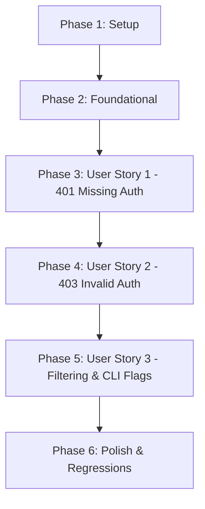

# Implementation Tasks: Negative Authentication Test Case Generation (401/403)

**Feature Branch**: `007-negative-auth-tests`
**Date**: 2026-09-20
**Spec**: [spec.md](./spec.md) | **Plan**: [plan.md](./plan.md)

---

## Phase 1: Setup (Shared Infrastructure)

**Purpose**: Verification of baseline test suite and setup of test directories and fixtures for Feature 007.

- [X] T001 Verify baseline test suite and quality gates by running `uv run pytest` across all existing 242 tests
- [X] T002 [P] Create unit test module `tests/unit/generator/test_negative_auth.py` for negative authentication generation
- [X] T003 [P] Create unit test module `tests/unit/exporter/test_negative_export.py` and update `generated_test_case_strategy` in `tests/unit/test_exporter_http.py` and `tests/unit/test_exporter_postman.py` to draw `test_type` and negative status codes so Hypothesis determinism property tests exercise negative paths

---

## Phase 2: Foundational (Blocking Prerequisites)

**Purpose**: Core data model extensions and credential mutation helper functions that all user stories depend on.

**CRITICAL**: Foundational tasks must be completed before user story tasks can proceed.

- [X] T004 Extend `GeneratedTestCase` in `src/specprobe/generator/models.py` with `test_type: str = Field(default="positive", description="Discriminator for positive vs negative test scenarios.")` and validate allowed values `{"positive", "negative_auth_missing", "negative_auth_invalid"}`
- [X] T005 [P] Implement core security inspection and credential invalidation helper functions (`is_secured_operation`, `get_all_security_target_names`, `get_invalid_credential_literal`) in `src/specprobe/generator/negative_auth.py`
- [X] T006 [P] Add foundational unit tests for `GeneratedTestCase` discriminator and credential invalidation helpers in `tests/unit/generator/test_negative_auth.py`

**Checkpoint**: Foundational models and helpers ready. User story implementation can now begin.

---

## Phase 3: User Story 1 - Missing Credentials Negative Test Case Generation & Export (401 Unauthorized) (Priority: P1) [MVP]

**Goal**: Automatically synthesize 401 Unauthorized negative test cases for secured operations by omitting all authentication credentials, and serialize them as sibling items in Postman and REST Client exports asserting HTTP 401.

**Independent Test**: Provide an operation chunk declaring Bearer or API Key authentication; verify a 401 test case is generated with auth headers/query params stripped and `test_type="negative_auth_missing"`; verify Postman export creates a sibling request `[401] <Title>` asserting `pm.response.to.have.status(401)`; verify REST Client export creates a request block with `# @name <op_id>_401` and `# Expected Status: 401`.

### Tests for User Story 1

- [X] T007 [P] [US1] Add unit tests in `tests/unit/generator/test_negative_auth.py` asserting `generate_401_test_case()` strips all auth headers and query parameters, sets `response.status_code = 401`, and assigns `test_type = "negative_auth_missing"`
- [X] T008 [P] [US1] Add unit tests in `tests/unit/exporter/test_negative_export.py` verifying Postman serialization of 401 test cases as sibling items inside the operation's tag folder with `[401]` name prefix and `pm.response.to.have.status(401)` assertion
- [X] T009 [P] [US1] Add unit tests in `tests/unit/exporter/test_negative_export.py` verifying REST Client (`.http`) serialization of 401 test cases with `# @name <op_id>_401`, `# Expected Status: 401`, and omitted auth headers

### Implementation for User Story 1

- [X] T010 [US1] Implement `generate_401_test_case(happy_tc: GeneratedTestCase, chunk: OperationChunk) -> GeneratedTestCase` in `src/specprobe/generator/negative_auth.py` to clone the happy-path request, strip all security headers and query params, set `status_code = 401`, and preserve operation traceability
- [X] T011 [US1] Update `_build_postman_item` and folder item grouping in `src/specprobe/exporter/postman.py` to serialize 401 test cases with `[401]` name prefix, omitted auth credentials, and `pm.response.to.have.status(401)` test script
- [X] T012 [US1] Update `_build_request_block` in `src/specprobe/exporter/http_client.py` to serialize 401 test cases with `# @name <op_id>_401`, `# Expected Status: 401`, and omitted credentials

**Checkpoint**: User Story 1 complete and testable independently. Missing credentials test generation and export fully functional.

---

## Phase 4: User Story 2 - Invalid Credentials Negative Test Case Generation & Export (403 Forbidden) (Priority: P2)

**Goal**: Automatically synthesize 403 Forbidden negative test cases for secured operations by replacing credentials for the primary resolved security scheme with protocol-valid invalid literals, and serialize them as sibling items in Postman and REST Client exports asserting HTTP 403.

**Independent Test**: Provide an operation chunk declaring HTTP Bearer, Basic, or API Key authentication; verify a 403 test case is generated with protocol-valid corrupted credentials (`Bearer invalid_token`, `Basic aW52YWxpZDppbnZhbGlk`, `invalid_<name>_key`) and `test_type="negative_auth_invalid"`; verify Postman export emits inline invalid literals on the request without modifying collection variables; verify REST Client export emits inline invalid literals without modifying file variables.

### Tests for User Story 2

- [X] T013 [P] [US2] Add unit tests in `tests/unit/generator/test_negative_auth.py` asserting `generate_403_test_case()` corrupts credentials for the primary resolved scheme across Bearer, Basic, API Key header, and API Key query, sets `response.status_code = 403`, and sets `test_type = "negative_auth_invalid"`
- [X] T014 [P] [US2] Add unit tests in `tests/unit/exporter/test_negative_export.py` verifying Postman serialization of 403 test cases with `[403]` name prefix, inline invalid literals directly on the request, `pm.response.to.have.status(403)` assertion, and exclusion from collection variable generation
- [X] T015 [P] [US2] Add unit tests in `tests/unit/exporter/test_negative_export.py` verifying REST Client serialization of 403 test cases with `# @name <op_id>_403`, `# Expected Status: 403`, inline invalid literals directly on request line/headers, and exclusion from top-level `@variable` definitions

### Implementation for User Story 2

- [X] T016 [US2] Implement `generate_403_test_case(happy_tc: GeneratedTestCase, chunk: OperationChunk) -> GeneratedTestCase` in `src/specprobe/generator/negative_auth.py` targeting the primary winning scheme with protocol-valid corrupted values
- [X] T017 [US2] Update `_build_postman_item` and variable aggregation in `src/specprobe/exporter/postman.py` to format 403 requests with inline invalid literals and restrict collection variable collection to positive test cases only
- [X] T018 [US2] Update `_build_request_block` and variable aggregation in `src/specprobe/exporter/http_client.py` to format 403 requests with inline invalid literals and restrict file variable collection to positive test cases only

**Checkpoint**: User Stories 1 AND 2 complete. Missing (401) and invalid (403) negative tests generate and export cleanly.

---

## Phase 5: User Story 3 - Selective & Unsecured Endpoint Filtering and CLI Flag Control (Priority: P3)

**Goal**: Ensure unauthenticated operations (`security: []` or omitted) produce no negative test cases, integrate negative generation into `GenerationEngine.generate_batch()`, and provide the `--negative-auth` / `--no-negative-auth` CLI flag on `specprobe generate`.

**Independent Test**: Run `specprobe generate` against mixed search results (public and secured endpoints); verify public endpoints only generate 1 test case while secured endpoints generate 3 test cases; verify passing `--no-negative-auth` suppresses all negative test generation.

### Tests for User Story 3

- [X] T019 [P] [US3] Add unit tests in `tests/unit/generator/test_negative_auth.py` asserting `generate_negative_auth_test_cases()` returns an empty list for unsecured operations (`security: []` or None) and operations with optional security (`{}`)
- [X] T020 [P] [US3] Add integration tests in `tests/integration/test_generate_cli.py` verifying `specprobe generate` produces 401 and 403 test cases by default, and suppresses them when `--no-negative-auth` is passed

### Implementation for User Story 3

- [X] T021 [US3] Implement composite orchestrator `generate_negative_auth_test_cases(happy_tc: GeneratedTestCase, chunk: OperationChunk) -> list[GeneratedTestCase]` in `src/specprobe/generator/negative_auth.py` that verifies operation security before dispatching 401 and 403 generators
- [X] T022 [US3] Update `GenerationEngine.generate_batch` in `src/specprobe/generator/engine.py` to accept `negative_auth: bool = True`, synthesizing and streaming 401 and 403 test cases immediately following each successful happy-path generation
- [X] T023 [US3] Update `generate_command` in `src/specprobe/cli.py` to add `@click.option("--negative-auth/--no-negative-auth", default=True, help="...")` and pass `negative_auth` to `GenerationEngine.generate_batch()`

**Checkpoint**: All three user stories complete and integrated end-to-end through the CLI.

---

## Phase 6: Polish & Cross-Cutting Concerns

**Purpose**: Regression testing, golden file updates, static type validation, and verification of quickstart scenarios.

- [X] T024 [P] Deliberately reconcile and regenerate existing security golden fixtures (`tests/fixtures/golden/security/security_cases.jsonl`, `security.postman.json`, `security.requests.http`) and pipeline tests (`tests/integration/test_security_pipeline.py`, `tests/unit/test_security_golden.py`) to incorporate the new default-on negative test cases (happy path + 401 + 403) rather than bypassing diffs with `--no-negative-auth`
- [X] T025 [P] Verify byte-for-byte reproducibility of the regenerated golden fixtures and all existing non-secured golden fixtures (`petstore.postman.json`, `petstore.requests.http`) in `tests/integration/test_export_golden.py` and `tests/unit/test_security_golden.py`
- [X] T026 Execute static type checking via `uv run ty check src/` and resolve any type diagnostics
- [X] T027 Execute linter and code formatting via `uv run ruff check .` and `uv run ruff format --check .`
- [X] T028 Execute full automated test suite via `uv run pytest` and verify 100% test pass rate with coverage
- [X] T029 Execute runnable validation scenarios from `specs/007-negative-auth-tests/quickstart.md` to confirm end-to-end workflow

---

## Dependencies & Execution Order

### Phase Dependencies

- **Phase 1 (Setup)**: Can start immediately.
- **Phase 2 (Foundational)**: Depends on Phase 1. Blocks all user stories.
- **Phase 3 (User Story 1 - P1)**: Depends on Phase 2. MVP core.
- **Phase 4 (User Story 2 - P2)**: Depends on Phase 3 (builds on 401 mutation & exporter patterns).
- **Phase 5 (User Story 3 - P3)**: Depends on Phase 4 (integrates both 401 and 403 into batch generation and CLI).
- **Phase 6 (Polish)**: Depends on Phase 5 completion.

### Parallel Opportunities

- **Phase 1**: T002 and T003 can run in parallel.
- **Phase 2**: T005 and T006 can run in parallel after T004.
- **Phase 3 (US1)**: Tests T007, T008, T009 can be authored in parallel before implementation.
- **Phase 4 (US2)**: Tests T013, T014, T015 can be authored in parallel before implementation.
- **Phase 5 (US3)**: Tests T019 and T020 can be authored in parallel.
- **Phase 6 (Polish)**: T024 and T025 can be executed in parallel.

---

## Implementation Strategy

### MVP First (User Story 1 Only)
1. Complete Phase 1 (Setup) and Phase 2 (Foundational).
2. Complete Phase 3 (User Story 1: 401 Missing Auth generation & export).
3. Validate: Run tests verifying 401 test case creation and export.

### Incremental Delivery
1. Foundation Ready (Phase 1 + 2): Models and helpers verified.
2. Deliver US1 (Phase 3): 401 missing credentials tests generated and exported.
3. Deliver US2 (Phase 4): 403 invalid credentials tests generated and exported.
4. Deliver US3 (Phase 5): CLI flag `--no-negative-auth` and unsecured operation filtering wired into batch pipeline.
5. Polish (Phase 6): Golden regression fixtures verified, `ty check src/` clean, `ruff` clean, `pytest` 100% green.
