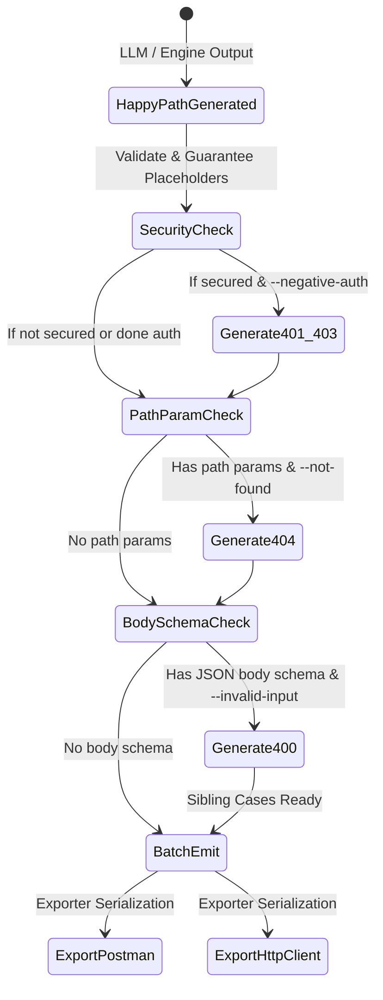

# Phase 1 Data Model: Negative Input & Resource Test Generation

**Feature**: `008-negative-input-tests`
**Date**: 2026-09-20
**Status**: Completed

## 1. Domain Entities & Schema Extensions

### 1.1 `TestType` Enumeration Extension
The `test_type` discriminator in `src/specprobe/generator/models.py` is extended to include 404 and 400 negative scenarios:

```python
TestType = Literal[
    "positive",
    "negative_auth_missing",
    "negative_auth_invalid",
    "negative_not_found",      # NEW: 404 Not Found (path parameter nonexistent entity)
    "negative_invalid_input",   # NEW: 400 Bad Request (request body schema violation)
]
```

### 1.2 `GeneratedTestCase` Model (Updated)
Core entity representing a runnable test case. The schema remains fully backward compatible:

```python
class GeneratedTestCase(BaseModel):
    test_type: TestType = "positive"
    operation_id: str = Field(..., description="Target OpenAPI operation identifier")
    description: str = Field("", description="Human-readable description or test name")
    request: RequestFixture = Field(..., description="HTTP request payload and parameters")
    response: ResponseAssertion = Field(..., description="Expected HTTP response assertion")
    tags: list[str] = Field(default_factory=list, description="Categorization tags")
    security: list[dict[str, list[str]]] | None = Field(
        default=None, description="OpenAPI security requirement object"
    )
    security_schemes: dict[str, Any] | None = Field(
        default=None, description="OpenAPI securityScheme definitions"
    )
```

---

## 2. Mutator Module Entities (`src/specprobe/generator/negative_input.py`)

### 2.1 `PathParameterMutator`
Deterministic transform responsible for mutating resource identifiers to nonexistent values.

```python
class PathParameterMutator:
    """Deterministic path parameter mutator for 404 Not Found generation."""

    SENTINEL_INTEGER: int = 999999
    SENTINEL_NIL_UUID: str = "00000000-0000-0000-0000-000000000000"
    SENTINEL_STRING_SLUG: str = "specprobe-nonexistent-id"

    @classmethod
    def find_leaf_path_parameter(
        cls,
        path_template: str,
        parameters: list[dict[str, Any]],
    ) -> tuple[str, dict[str, Any]] | None:
        """Locate the last path parameter in the route template and its schema definition."""
        ...

    @classmethod
    def get_nonexistent_sentinel(cls, param_def: dict[str, Any]) -> str:
        """Determine the nonexistent value based on parameter schema type and format."""
        ...

    @classmethod
    def mutate_path_params(
        cls,
        path_template: str,
        current_params: dict[str, str],
        parameters: list[dict[str, Any]],
    ) -> dict[str, str] | None:
        """Return a copy of path_params with only the leaf parameter mutated."""
        ...
```

### 2.2 `RequestBodyMutator`
Deterministic transform responsible for minimally violating request body schemas.

```python
class RequestBodyMutator:
    """Deterministic request body mutator for 400 Bad Request generation."""

    TYPE_CORRUPTIONS: dict[str, Any] = {
        "string": ["__specprobe_invalid_type__"],
        "integer": "__specprobe_not_a_number__",
        "number": "__specprobe_not_a_number__",
        "boolean": "__specprobe_not_a_boolean__",
        "array": "__specprobe_not_an_array__",
        "object": "__specprobe_not_an_object__",
    }

    @classmethod
    def get_json_schema(cls, chunk: OperationChunk) -> dict[str, Any] | None:
        """Extract the JSON request body schema if present and constrained."""
        ...

    @classmethod
    def mutate_json_body(
        cls,
        body: Any,
        schema: dict[str, Any],
    ) -> Any | None:
        """Apply minimal violation: omit first required property or invert first property type."""
        ...
```

---

## 3. Generator Engine Interfaces (`src/specprobe/generator/negative_input.py`)

### 3.1 Public Functions
```python
def generate_404_test_case(
    positive_tc: GeneratedTestCase,
    chunk: OperationChunk,
) -> GeneratedTestCase | None:
    """Generate a 404 Not Found negative test case by mutating the leaf path parameter."""
    ...

def generate_400_test_case(
    positive_tc: GeneratedTestCase,
    chunk: OperationChunk,
) -> GeneratedTestCase | None:
    """Generate a 400 Bad Request negative test case by violating the request body schema."""
    ...

def generate_negative_input_test_cases(
    positive_tc: GeneratedTestCase,
    chunk: OperationChunk,
    not_found: bool = True,
    invalid_input: bool = True,
) -> list[GeneratedTestCase]:
    """Generate both 404 and 400 negative test cases as applicable."""
    ...
```

---

## 4. State Transitions & Lifecycle


