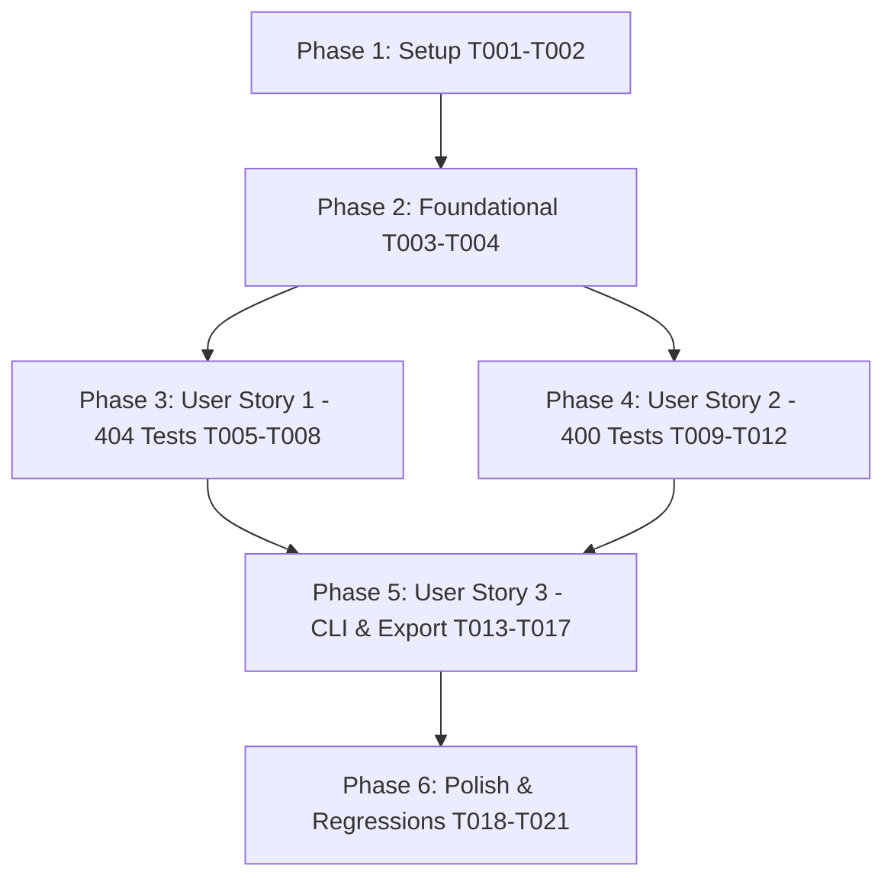

# Tasks: Negative Input & Resource Test Generation (400 & 404)

**Feature**: `008-negative-input-tests`
**Input**: Feature specification from `specs/008-negative-input-tests/spec.md` and implementation plan from `specs/008-negative-input-tests/plan.md`
**Status**: Ready for Implementation

---

## Phase 1: Setup (Shared Infrastructure)

**Purpose**: Core model extensions and module initialization

- [ ] T001 Extend `TestType` literal in `src/specprobe/generator/models.py` with `"negative_not_found"` and `"negative_invalid_input"`
- [ ] T002 Create initial module `src/specprobe/generator/negative_input.py` with module docstring, imports, and `__all__` exports

---

## Phase 2: Foundational (Blocking Prerequisites)

**Purpose**: Formatting and property serialization prerequisites that all user stories depend on

- [ ] T003 [P] Update JSONL serialization/deserialization helper in `src/specprobe/formatters/jsonl.py` to ensure `negative_not_found` and `negative_invalid_input` test cases roundtrip cleanly without data loss
- [ ] T004 [P] Update Hypothesis property test strategy in `tests/unit/test_generator_models.py` to draw `negative_not_found` and `negative_invalid_input` alongside existing `test_type` values

**Checkpoint**: Foundation ready — user story implementation can now begin.

---

## Phase 3: User Story 1 - Deterministic 404 Not-Found Test Generation (Priority: P1) 🎯 MVP

**Goal**: Deterministically generate a 404 Not Found negative test case (`negative_not_found`) for operations with path parameters, mutating the leaf parameter to a nonexistent sentinel while preserving all other parameters, headers, and credentials.

**Independent Test**: Run unit tests on operations with integer, UUID, and string path parameters; verify leaf parameter mutated to sentinel, other path params and credentials preserved, and status 404 asserted. Operations without path parameters skipped.

### Tests for User Story 1

- [ ] T005 [P] [US1] Write unit tests for `PathParameterMutator` and `generate_404_test_case` in `tests/unit/generator/test_negative_input.py` covering integer (`999999`), UUID (nil UUID), string (`"specprobe-nonexistent-id"`), enum sentinels, multi-parameter routes (mutating leaf only), and operations without path parameters

### Implementation for User Story 1

- [ ] T006 [US1] Implement `PathParameterMutator` in `src/specprobe/generator/negative_input.py` with leaf parameter discovery (`find_leaf_path_parameter`) and type-based sentinel generation (`get_nonexistent_sentinel`)
- [ ] T007 [US1] Implement `generate_404_test_case(positive_tc, chunk)` in `src/specprobe/generator/negative_input.py`, setting `test_type="negative_not_found"`, expected status 404, description `"[404] Resource not found - {op_id}"`, tags `["negative", "404", "not_found"]`, and returning `None` for operations without path parameters
- [ ] T008 [US1] Integrate `generate_404_test_case` into `GenerationEngine.generate_batch` in `src/specprobe/generator/engine.py`, gated by `not_found: bool = True` parameter

**Checkpoint**: At this point, User Story 1 is fully functional and testable independently as an MVP.

---

## Phase 4: User Story 2 - Deterministic 400 Invalid-Input Schema Violation Test Generation (Priority: P2)

**Goal**: Deterministically generate a 400 Bad Request negative test case (`negative_invalid_input`) for operations with a schema-constrained JSON request body, mutating the payload by omitting the first required property or inverting the first property type.

**Independent Test**: Run unit tests on operations with required fields, non-required fields, and array schemas; verify exactly one 400 test case emitted per operation, credentials and path parameters preserved, and status 400 asserted. Bodiless/non-JSON operations skipped.

### Tests for User Story 2

- [ ] T009 [P] [US2] Write unit tests for `RequestBodyMutator` and `generate_400_test_case` in `tests/unit/generator/test_negative_input.py` covering required property omission, property type inversion, array inversion, and bodiless/non-JSON operation skipping

### Implementation for User Story 2

- [ ] T010 [US2] Implement `RequestBodyMutator` in `src/specprobe/generator/negative_input.py` to extract `application/json` / `application/*+json` schemas and apply minimal schema-violating mutations (omitting first required property in schema order or inverting first property type)
- [ ] T011 [US2] Implement `generate_400_test_case(positive_tc, chunk)` and combined dispatcher `generate_negative_input_test_cases` in `src/specprobe/generator/negative_input.py`, setting `test_type="negative_invalid_input"`, status 400, description `"[400] Invalid input - {op_id}"`, tags `["negative", "400", "invalid_input"]`, and returning `None` for bodiless or non-JSON operations
- [ ] T012 [US2] Integrate `generate_400_test_case` into `GenerationEngine.generate_batch` in `src/specprobe/generator/engine.py`, gated by `invalid_input: bool = True` parameter

**Checkpoint**: User Stories 1 and 2 are both functional and testable independently.

---

## Phase 5: User Story 3 - Independent CLI Control & Sibling Export Serialization (Priority: P3)

**Goal**: Expose independent CLI flag pairs `--not-found/--no-not-found` and `--invalid-input/--no-invalid-input` on `specprobe generate`, and export 404 and 400 sibling test cases to Postman collections and REST Client `.http` files with status assertions and credential parameterization.

**Independent Test**: Verify CLI flags selectively toggle 404 and 400 test cases, and verify `generate_postman_collection` and `generate_http_document` serialize `[404]`, `[400]`, `# @name <op>_404`, `# @name <op>_400` with status assertions and valid collection/file variable parameterization.

### Tests for User Story 3

- [ ] T013 [P] [US3] Write unit tests in `tests/unit/exporter/test_negative_input_export.py` asserting Postman and REST Client export formatting for `negative_not_found` and `negative_invalid_input` test cases (item prefixes `[404]`/`[400]`, script status assertions, `# @name <op>_404`/`# @name <op>_400`, `# Expected Status: 404/400`, and parameterized credentials)
- [ ] T014 [P] [US3] Write CLI integration tests in `tests/integration/test_generate_cli.py` verifying `--no-not-found` and `--no-invalid-input` flags independently omit corresponding negative test cases while keeping others

### Implementation for User Story 3

- [ ] T015 [US3] Add CLI option pairs `--not-found/--no-not-found` and `--invalid-input/--no-invalid-input` to `generate` command in `src/specprobe/cli.py` and forward flags to `GenerationEngine.generate_batch`
- [ ] T016 [US3] Update `_build_postman_item` and `generate_postman_collection` in `src/specprobe/exporter/postman.py` to prepend `[404]` and `[400]` item name prefixes, assert `pm.response.to.have.status(404/400)` in test scripts, retain collection variable parameterization (`Bearer {{bearerAuth}}`), and register collection variables
- [ ] T017 [US3] Update `_build_request_block` and `generate_http_document` in `src/specprobe/exporter/http_client.py` to emit `# @name <op>_404` and `# @name <op>_400` request blocks with `# Expected Status: 404/400` comments, retaining file variable parameterization (`Authorization: Bearer {{bearerAuth}}`) and top-level `@bearerAuth` file variables

**Checkpoint**: All three user stories are functional, independently testable, and integrated end-to-end.

---

## Phase 6: Polish & Cross-Cutting Concerns

**Purpose**: Property testing, golden fixture reconciliation, and verification quality gates

- [ ] T018 [P] Update Hypothesis property test strategies in `tests/unit/test_exporter_postman.py` and `tests/unit/test_exporter_http.py` to draw `negative_not_found` and `negative_invalid_input` test cases and 404/400 status codes
- [ ] T019 Reconcile existing golden fixtures (`tests/fixtures/golden/security/security_cases.jsonl`, `security.postman.json`, `security.requests.http`) to include new default 404 and 400 negative sibling cases
- [ ] T020 [P] Execute end-to-end quickstart validation scenarios from `specs/008-negative-input-tests/quickstart.md`
- [ ] T021 Run full quality gates: `uv run ty check src/`, `uv run ruff check .`, `uv run ruff format --check .`, and `uv run pytest`

---

## Dependencies & Execution Order



### User Story Completion Order
1. **User Story 1 (P1)**: Can proceed immediately after Phase 2 Foundational. Delivers MVP (404 not-found generation).
2. **User Story 2 (P2)**: Can proceed immediately after Phase 2 Foundational. Delivers 400 invalid-input generation.
3. **User Story 3 (P3)**: Depends on US1 and US2 transforms being available to wire into CLI flags and exporter serialization.
4. **Polish (Phase 6)**: Runs after all stories complete to update property strategies, golden fixtures, and verify quality gates.

---

## Parallel Execution Examples

### User Story 1
```bash
# Launch test and model tasks in parallel:
Task T005: "Write unit tests for PathParameterMutator in tests/unit/generator/test_negative_input.py"
Task T006: "Implement PathParameterMutator in src/specprobe/generator/negative_input.py"
```

### User Story 2
```bash
# Launch test and mutator tasks in parallel:
Task T009: "Write unit tests for RequestBodyMutator in tests/unit/generator/test_negative_input.py"
Task T010: "Implement RequestBodyMutator in src/specprobe/generator/negative_input.py"
```

### User Story 3
```bash
# Launch CLI and export unit test tasks in parallel:
Task T013: "Write unit tests in tests/unit/exporter/test_negative_input_export.py"
Task T014: "Write CLI integration tests in tests/integration/test_generate_cli.py"
```

---

## Implementation Strategy

### MVP First (User Story 1 Only)
1. Complete Phase 1 (Setup) and Phase 2 (Foundational).
2. Complete Phase 3 (User Story 1: 404 Not-Found).
3. **Validate**: Run unit tests in `tests/unit/generator/test_negative_input.py` to prove 404 path parameter mutation works independently.

### Incremental Delivery
1. Foundation ready (T001-T004).
2. Add 404 generation (T005-T008) -> Validated MVP.
3. Add 400 generation (T009-T012) -> Both negative input mutators functional.
4. Add CLI flags and Exporter integration (T013-T017) -> Full end-to-end pipeline ready.
5. Polish, Golden reconciliation, Quality gates (T018-T021) -> Production ready.
