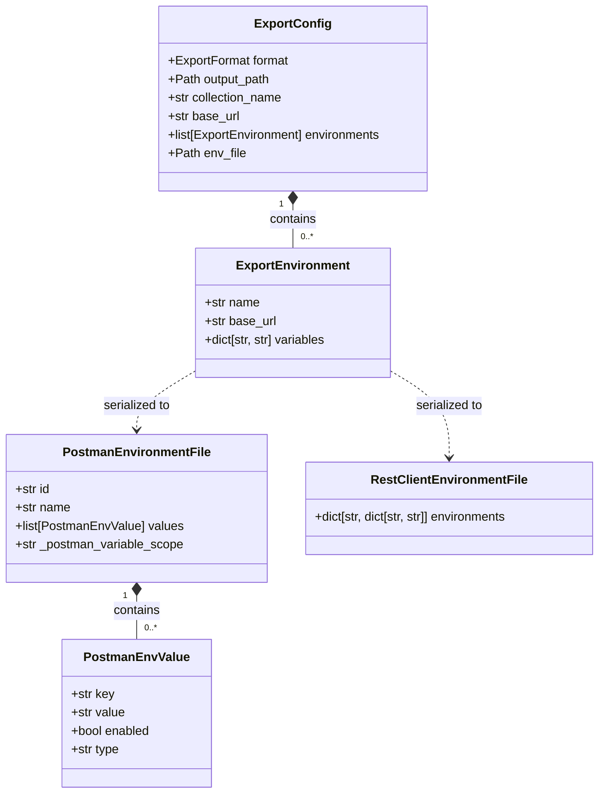

# Data Model: Environment File Export

**Feature Branch**: `010-env-file-export`
**Date**: 2026-09-21
**Spec**: [spec.md](file:///C:/Users/mwalc/source/repos/specprobe/specs/010-env-file-export/spec.md)

---

## 1. Core Entities



---

## 2. Entity Specifications

### 2.1 `ExportEnvironment`
Represents a single named deployment environment target.

```python
class ExportEnvironment(BaseModel):
    """Named environment configuration for export."""

    model_config = ConfigDict(extra="forbid")

    name: str = Field(
        ...,
        description="Unique identifier for the environment (e.g. 'local', 'work', 'staging')",
        min_length=1,
    )
    base_url: str = Field(
        ...,
        description="Target API server root URL for this environment",
        min_length=1,
    )
    variables: dict[str, str] = Field(
        default_factory=dict,
        description="Optional custom variable mappings (e.g. credentials, tokens) for this environment",
    )
```

**Validation Rules**:
- `name` must be non-empty and stripped of leading/trailing whitespace.
- `base_url` must be a valid URL string, normalized by stripping trailing slashes.
- Slashes and special filesystem characters in `name` are sanitized when generating Postman environment filenames (e.g., `sanitize_filename(env.name)`).

---

### 2.2 `ExportConfig` (Updated)
Updated runtime configuration model for `specprobe export`.

```python
class ExportConfig(BaseModel):
    """Runtime configuration for specprobe export command."""

    model_config = ConfigDict(extra="forbid")

    format: ExportFormat = Field(
        default=ExportFormat.BOTH,
        description="Target export artifact format(s)",
    )
    output_path: Path | None = Field(
        default=None,
        description="Destination output file path (for single format) or directory (for both)",
    )
    collection_name: str | None = Field(
        default=None,
        description="Custom title/name for exported Postman collection",
    )
    base_url: str = Field(
        default="http://localhost:8000",
        description="Legacy fallback base URL, mapped to a 'default' environment if no environments specified",
    )
    environments: list[ExportEnvironment] = Field(
        default_factory=list,
        description="List of resolved target environments to emit as environment files",
    )
    env_file: Path | None = Field(
        default=None,
        description="Path to user-supplied JSON or YAML environment configuration file",
    )
```

---

### 2.3 `PostmanEnvironmentFile`
Schema model representing Postman's native environment file format.

```python
class PostmanEnvValue(BaseModel):
    """Single variable entry in Postman environment schema."""

    key: str
    value: str
    enabled: bool = True
    type: str = "default"


class PostmanEnvironmentFile(BaseModel):
    """Native Postman Environment v2.1.0 data structure."""

    id: str = Field(description="Deterministic UUIDv5 based on environment name")
    name: str = Field(description="Environment display name in Postman")
    values: list[PostmanEnvValue] = Field(default_factory=list)
    postman_variable_scope: str = Field(
        default="environment",
        alias="_postman_variable_scope",
    )
```

**Generation Logic**:
- Variable `baseUrl` is always added with value `env.base_url`.
- Security variables are added with either `env.variables[key]` or `cred.default_placeholder`.
- Variables are sorted alphabetically by `key` for determinism.

---

### 2.4 `RestClientEnvironmentFile`
Schema representing VS Code REST Client's `http-client.env.json`.

```python
# Plain JSON object mapping environment name to key-value pairs
{
    "local": {"baseUrl": "http://localhost:8000", "apiKey": "<api_key>"},
    "work": {"baseUrl": "https://api.work.internal", "apiKey": "<api_key>"},
}
```

**Generation Logic**:
- Emitted as a single file containing all resolved environments as root keys.
- Under each environment key, `baseUrl` is populated with `env.base_url`.
- Security scheme variables are populated with either `env.variables[key]` or `cred.default_placeholder`.
- Keys under each environment are sorted alphabetically for determinism.
