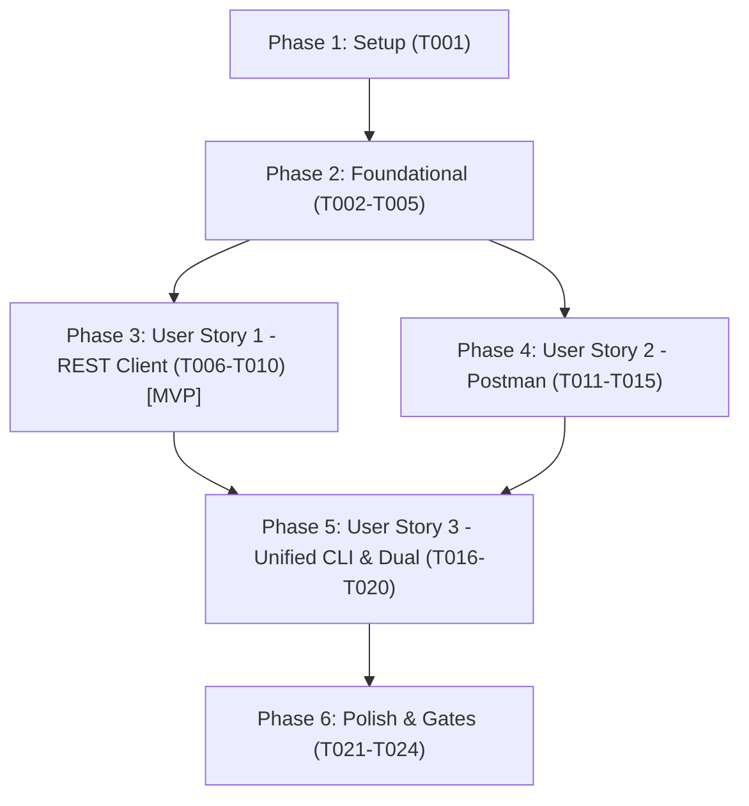

# Tasks: Environment File Export for Postman and REST Client

**Branch**: `010-env-file-export` | **Date**: 2026-09-21 | **Spec**: [spec.md](file:///C:/Users/mwalc/source/repos/specprobe/specs/010-env-file-export/spec.md) | **Plan**: [plan.md](file:///C:/Users/mwalc/source/repos/specprobe/specs/010-env-file-export/plan.md)

---

## Phase 1: Setup (Shared Infrastructure)

**Purpose**: Verify environment dependencies and setup test fixtures for environment export.

- [X] T001 Create environment test fixture files for JSON and YAML configs in `tests/fixtures/environments/sample_env.yaml` and `tests/fixtures/environments/sample_env.json`

---

## Phase 2: Foundational (Blocking Prerequisites)

**Purpose**: Core data models and utilities that MUST be complete before user stories can be implemented.

**⚠️ CRITICAL**: Foundational tasks must complete before user story implementation begins.

- [X] T002 [P] Define `ExportEnvironment` model with fields `name: str` (min_length=1, trimmed), `base_url: str` (min_length=1, trailing slashes stripped), and `variables: dict[str, str]` with `extra="forbid"` in `src/specprobe/exporter/models.py`
- [X] T003 [P] Update `ExportConfig` in `src/specprobe/exporter/models.py` adding `environments: list[ExportEnvironment] = Field(default_factory=list)` and `env_file: Path | None = Field(default=None)`
- [X] T004 [P] Implement `sanitize_environment_filename(name: str) -> str` helper in `src/specprobe/exporter/utils.py` replacing invalid filesystem characters with underscores
- [X] T005 [P] Add unit tests for `ExportEnvironment` validation and `ExportConfig` extra forbidding in `tests/unit/test_exporter_models.py`

**Checkpoint**: Foundational models and helpers verified; user story implementation can begin.

---

## Phase 3: User Story 1 - Multi-Environment REST Client Export (`http-client.env.json`) (Priority: P1) 🎯 MVP

**Goal**: Export API test cases for VS Code REST Client with a native `http-client.env.json` file. The `.http` file omits hardcoded `@baseUrl` and `@schemeName` lines, referencing `{{baseUrl}}` and `{{schemeName}}` dynamically.

**Independent Test**: Run `specprobe export --format http -o ./out_test/requests.http --env local=http://localhost:8000 --env work=https://api.work.internal`. Verify that `./out_test/requests.http` has no `@baseUrl` line and references `{{baseUrl}}`, and `./out_test/http-client.env.json` contains `local` and `work` environment entries.

### Tests for User Story 1

> **NOTE: Write these tests FIRST, ensure they FAIL before implementation**

- [X] T006 [P] [US1] Add unit tests for `generate_rest_client_environments` verifying dictionary-of-dictionaries JSON structure, `baseUrl`, and credential fallback to `cred.default_placeholder` in `tests/unit/test_exporter_http_client.py`
- [X] T007 [P] [US1] Add unit tests for `generate_http_document` verifying omission of `@baseUrl` and `@schemeName` header declarations when `include_env_header=False` in `tests/unit/test_exporter_http_client.py`

### Implementation for User Story 1

- [X] T008 [US1] Implement `generate_rest_client_environments(environments: list[ExportEnvironment], test_cases: list[GeneratedTestCase]) -> dict[str, dict[str, str]]` in `src/specprobe/exporter/http_client.py`
- [X] T009 [US1] Update `generate_http_document` in `src/specprobe/exporter/http_client.py` with `include_env_header: bool = True` parameter to suppress top-level `@baseUrl` and security variable declarations when environment files are active
- [X] T010 [US1] Update `export_batch` in `src/specprobe/exporter/engine.py` for `ExportFormat.HTTP` to serialize `http-client.env.json` into output directory or output file's parent directory

**Checkpoint**: User Story 1 complete and independently testable as MVP.

---

## Phase 4: User Story 2 - Native Postman Environment Export (`.postman_environment.json`) (Priority: P1)

**Goal**: Export Postman collections alongside native `<env>.postman_environment.json` files conforming to Postman Environment v2.1 schema. The collection omits baked-in `baseUrl` and credential variables from `collection["variable"]`.

**Independent Test**: Run `specprobe export --format postman -o ./out_pm --env local=http://localhost:8000 --env work=https://api.work.internal`. Verify that `./out_pm/collection.json` has an empty `variable` array, and `./out_pm/local.postman_environment.json` and `./out_pm/work.postman_environment.json` exist with valid schema (`id`, `name`, `values`, `_postman_variable_scope`).

### Tests for User Story 2

> **NOTE: Write these tests FIRST, ensure they FAIL before implementation**

- [X] T011 [P] [US2] Add unit tests for `generate_postman_environment` verifying Postman v2.1 schema, deterministic UUIDv5, and credential variable values in `tests/unit/test_exporter_postman.py`
- [X] T012 [P] [US2] Add unit tests for `generate_postman_collection` verifying suppression of `baseUrl` and credential variables when `include_variables=False` in `tests/unit/test_exporter_postman.py`

### Implementation for User Story 2

- [X] T013 [US2] Implement `generate_postman_environment(env: ExportEnvironment, test_cases: list[GeneratedTestCase]) -> dict[str, Any]` in `src/specprobe/exporter/postman.py` with deterministic UUIDv5 based on `specprobe:env:{env.name}`
- [X] T014 [US2] Update `generate_postman_collection` in `src/specprobe/exporter/postman.py` with `include_variables: bool = True` parameter to omit collection-level `baseUrl` and credential variables when environments are active
- [X] T015 [US2] Update `export_batch` in `src/specprobe/exporter/engine.py` for `ExportFormat.POSTMAN` to serialize `<sanitized_name>.postman_environment.json` files into output directory or output file's parent directory

**Checkpoint**: User Stories 1 AND 2 are functional and independently testable.

---

## Phase 5: User Story 3 - Unified CLI Multi-Environment Configuration & Backward Compatibility (Priority: P2)

**Goal**: Provide repeatable `--env <name>=<url>` CLI options, `--env-file <path>` (JSON/YAML) configuration input, backward-compatible `--base-url` shorthand, and output validation rules.

**Independent Test**: Run `specprobe export` with `--env-file tests/fixtures/environments/sample_env.yaml -o ./out_cli`, `--env override=http://localhost:9000`, `--format both`, and test that omitting `--output` exits with code 1.

### Tests for User Story 3

> **NOTE: Write these tests FIRST, ensure they FAIL before implementation**

- [X] T016 [P] [US3] Add unit tests for environment CLI string parsing (`parse_env_cli_option`) and config file loading (`load_environment_config_file`) in `tests/unit/test_exporter_engine.py`
- [X] T017 [P] [US3] Add integration tests in `tests/integration/test_cli_export.py` for CLI export with multiple `--env` flags, `--env-file` (JSON and YAML), legacy `--base-url` backward compatibility, missing `--output` error, and dual format (`--format both`) output

### Implementation for User Story 3

- [X] T018 [US3] Implement `parse_env_cli_option` (splitting on `=`) and `load_environment_config_file` (supporting `.json`, `.yaml`, `.yml` via PyYAML) with merging precedence in `src/specprobe/exporter/engine.py`
- [X] T019 [US3] Update `export_command` in `src/specprobe/cli.py` to add `--env` (multiple=True) and `--env-file` options, validate duplicates, enforce `--output` requirement when environments are active, and handle backward compatibility for `--base-url`
- [X] T020 [US3] Update `export_batch` in `src/specprobe/exporter/engine.py` for `ExportFormat.BOTH` to emit `collection.json`, `requests.http`, `http-client.env.json`, and all `*.postman_environment.json` files in the output directory

**Checkpoint**: All user stories complete with unified CLI parsing and backward compatibility.

---

## Phase 6: Polish & Cross-Cutting Concerns

**Purpose**: End-to-end verification, quality gate enforcement, and documentation validation.

- [X] T021 [P] Validate all quickstart scenarios end-to-end per `specs/010-env-file-export/quickstart.md`
- [X] T022 Run Ruff linter and formatter checks via `uv run ruff check .` and `uv run ruff format --check .`
- [X] T023 Run static type checking via `uv run ty check src/`
- [X] T024 Run full test suite and pre-commit checks via `uv run pytest` and `uv run pre-commit run --all-files`

---

## Dependencies & Execution Order

### Phase Dependencies



### User Story Dependencies

- **Foundational (Phase 2)**: Blocks all user stories.
- **User Story 1 (P1 - REST Client)**: Independent of Postman export; establishes `http-client.env.json` and header omission in `http_client.py`.
- **User Story 2 (P1 - Postman)**: Independent of REST Client export; establishes `<env>.postman_environment.json` and variable suppression in `postman.py`.
- **User Story 3 (P2 - Unified CLI & Dual Export)**: Depends on US1 and US2 to bind CLI options (`--env`, `--env-file`, `--base-url`) to both exporters and coordinate dual-format emission.
- **Polish (Phase 6)**: Runs after all user stories are complete.

### Parallel Opportunities

- **Phase 2 (Foundational)**: T002, T003, T004, T005 can be developed in parallel across models, utils, and tests.
- **Phase 3 (User Story 1 Tests)**: T006 and T007 can be written in parallel.
- **Phase 4 (User Story 2 Tests)**: T011 and T012 can be written in parallel.
- **Phase 3 & Phase 4**: Once Foundational (Phase 2) is complete, US1 and US2 can be implemented in parallel by different developers.
- **Phase 5 (User Story 3 Tests)**: T016 and T017 can be written in parallel.

---

## Parallel Example: User Story 1

```bash
# Write test cases for US1 concurrently:
Task T006: "Add unit tests for generate_rest_client_environments in tests/unit/test_exporter_http_client.py"
Task T007: "Add unit tests for generate_http_document in tests/unit/test_exporter_http_client.py"
```

## Parallel Example: User Story 2

```bash
# Write test cases for US2 concurrently:
Task T011: "Add unit tests for generate_postman_environment in tests/unit/test_exporter_postman.py"
Task T012: "Add unit tests for generate_postman_collection in tests/unit/test_exporter_postman.py"
```

---

## Implementation Strategy

### MVP First (User Story 1 Only)
1. Complete Phase 1 (Setup) and Phase 2 (Foundational).
2. Implement Phase 3 (User Story 1 - REST Client export).
3. Validate REST Client export independently: `requests.http` without header variables and `http-client.env.json` created.

### Incremental Delivery
1. **Increment 1**: MVP REST Client export working (US1).
2. **Increment 2**: Postman native environment export working (US2).
3. **Increment 3**: CLI repeatable `--env`, `--env-file` (JSON/YAML), backward-compatible `--base-url`, and dual export (`--format both`) (US3).
4. **Increment 4**: Code formatting, type check (`ty`), pre-commit hooks, and complete test suite verification (Polish).
