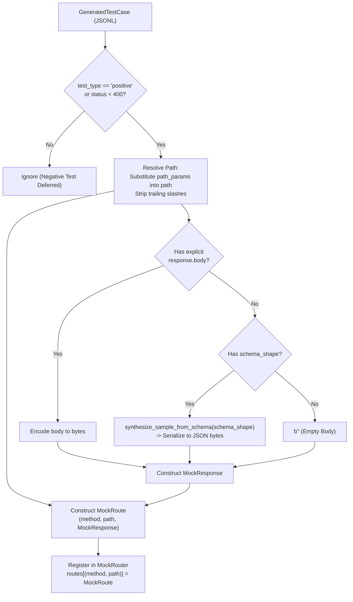

# Data Model: Minimal Local Mock Server (`specprobe mock`)

**Feature**: `011-mock-server` | **Date**: 2026-09-22 | **Spec**: [spec.md](file:///C:/Users/mwalc/source/repos/specprobe/specs/011-mock-server/spec.md)

---

## Entities & Schemas

### 1. `MockResponse`

Represents the concrete HTTP response data served when an incoming request matches a registered route.

```python
from pydantic import BaseModel, Field


class MockResponse(BaseModel):
    """Concrete canned HTTP response served by the mock server."""

    status_code: int = Field(
        ...,
        ge=100,
        le=599,
        description="HTTP status code to return (e.g. 200, 201, 204).",
    )
    headers: dict[str, str] = Field(
        default_factory=dict,
        description="HTTP response headers to emit (e.g. {'Content-Type': 'application/json'}).",
    )
    body: bytes = Field(
        default=b"",
        description="Pre-serialized byte payload to write to the HTTP response stream.",
    )
```

**Validation & Invariants**:
- If `status_code == 204` (No Content), `body` MUST be `b""` and `Content-Length` MUST be 0 (or omitted).
- `headers` keys are preserved; `Content-Length` is automatically computed from `len(body)` if not explicitly provided.

---

### 2. `MockRoute`

Represents a single registered mock route mapping an HTTP method and normalized resolved path to a canned `MockResponse`.

```python
from pydantic import BaseModel, Field


class MockRoute(BaseModel):
    """Registered mock route representing an available endpoint."""

    method: str = Field(
        ...,
        description="Uppercase HTTP method (e.g. 'GET', 'POST', 'PUT', 'DELETE').",
    )
    path: str = Field(
        ...,
        description="Normalized URI path with resolved path parameters (e.g. '/pets/42').",
    )
    operation_id: str = Field(
        ...,
        description="Traceable identifier of the target API operation.",
    )
    response: MockResponse = Field(
        ...,
        description="Canned response served upon request match.",
    )
    tags: list[str] = Field(
        default_factory=list,
        description="Operational tags inherited from GeneratedTestCase.",
    )
```

**Validation & Invariants**:
- `method` is normalized to uppercase (`"GET"`, `"POST"`, etc.).
- `path` is normalized by ensuring a leading slash `/` and stripping any trailing slash (except when `path == "/"`).
- Route key is the tuple `(method, path)`.

---

### 3. `MockServerConfig`

Configuration parameters controlling server initialization, socket binding, and route population.

```python
from pathlib import Path
from pydantic import BaseModel, Field


class MockServerConfig(BaseModel):
    """Configuration options for initializing the MockServer."""

    host: str = Field(
        default="127.0.0.1",
        description="Network host interface to bind (default: '127.0.0.1' / 'localhost').",
    )
    port: int = Field(
        default=8000,
        ge=1,
        le=65535,
        description="TCP port to bind (default: 8000).",
    )
    input_source: Path | str = Field(
        ...,
        description="File path to test cases JSONL or '-' for standard input.",
    )
```

---

### 4. `MockAccessLogEntry`

Represents a structured record of a processed incoming HTTP request for console logging and test assertions.

```python
from datetime import datetime
from pydantic import BaseModel, Field


class MockAccessLogEntry(BaseModel):
    """Record of a processed HTTP request."""

    timestamp: datetime = Field(
        ...,
        description="Timestamp when the request was received.",
    )
    method: str = Field(
        ...,
        description="HTTP method of the incoming request.",
    )
    path: str = Field(
        ...,
        description="Requested URI path (excluding query string).",
    )
    status_code: int = Field(
        ...,
        description="HTTP response status code returned.",
    )
    latency_ms: float = Field(
        ...,
        ge=0.0,
        description="Time taken to process and respond in milliseconds.",
    )
    matched: bool = Field(
        ...,
        description="True if request matched a registered route; False if 404/405.",
    )
```

---

## Route Resolution & Mapping Pipeline


